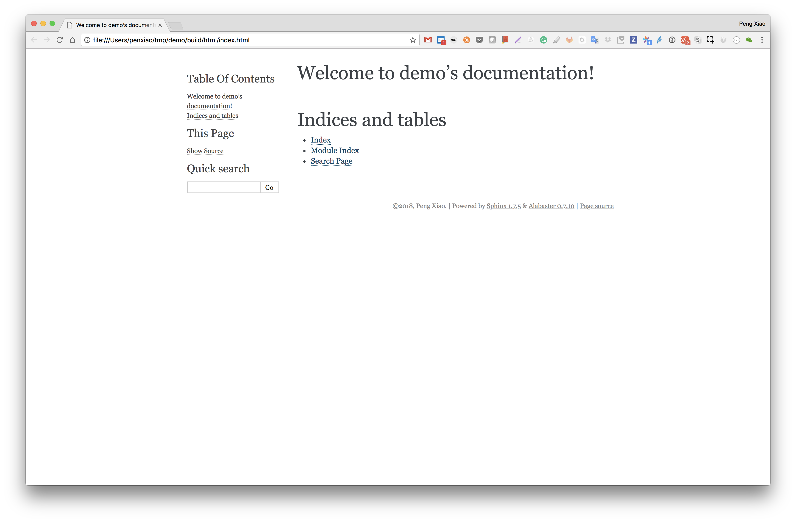

# sphinx-docker

[](https://quay.io/repository/oh-my-docker/sphinx)

Play sphinx just through docker and without installing Python and Sphinx on your computer.

```bash
docker pull quay.io/oh-my-docker/sphinx
```

## Create a Sphinx project

Create a sphinx project under `/Users/penxiao/tmp/demo`

```bash
$ docker run -it --rm -v /Users/penxiao/tmp/demo:/omd quay.io/oh-my-docker/sphinx sphinx-quickstart
Welcome to the Sphinx 1.7.5 quickstart utility.

....
```

How to use sphinx and sphinx-quickstart, please reference [Sphinx Documentation](http://www.sphinx-doc.org/en/master/contents.html#)

## Edit Source

We can use any editor to edit rst source files in `source` folder.

## Build html

And finished, we can run `make html` and html files will be located in `/Users/penxiao/tmp/demo/build/html`.

```bash
$ docker run -it --rm -v /Users/penxiao/tmp/demo:/omd quay.io/oh-my-docker/sphinx make html
Running Sphinx v1.7.5
making output directory...
loading pickled environment... not yet created
building [mo]: targets for 0 po files that are out of date
building [html]: targets for 1 source files that are out of date
updating environment: 1 added, 0 changed, 0 removed
reading sources... [100%] index
looking for now-outdated files... none found
pickling environment... done
checking consistency... done
preparing documents... done
writing output... [100%] index
generating indices... genindex
writing additional pages... search
copying static files... done
copying extra files... done
dumping search index in English (code: en) ... done
dumping object inventory... done
build succeeded.

The HTML pages are in build/html.
$ cd /Users/penxiao/tmp/demo
$ ls
Makefile build    make.bat source
$ cd build
$ ls
doctrees html
$ cd html
$ ls
_sources       _static        genindex.html  index.html     objects.inv    search.html    searchindex.js
```

open the file `index.html` with the browser, and you will see:



## Sphinx themes

we can use pip to install some themes and use them in source file config.py

for example, we want to use the theme `sphinx_rtd_theme`, first, change the html_theme in config.py

```python
# The theme to use for HTML and HTML Help pages.  See the documentation for
# a list of builtin themes.
#
html_theme = 'sphinx_rtd_theme'

```

then build with pip install `sphinx_rtd_theme`

```bash
$ docker run -it --rm -v /Users/penxiao/tmp/demo:/omd quay.io/oh-my-docker/sphinx sh -c "pip install sphinx_rtd_theme; make html"
Collecting sphinx_rtd_theme
  Downloading https://files.pythonhosted.org/packages/47/33/e3a1cc08acf0c50418c505d1b954adc950141ace691e3b4a22ba91950a32/sphinx_rtd_theme-0.3.1-py2.py3-none-any.whl (2.2MB)
    100% |████████████████████████████████| 2.2MB 11.2MB/s
Installing collected packages: sphinx-rtd-theme
Successfully installed sphinx-rtd-theme-0.3.1
Running Sphinx v1.7.5
loading pickled environment... done
building [mo]: targets for 0 po files that are out of date
building [html]: targets for 1 source files that are out of date
updating environment: 0 added, 0 changed, 0 removed
looking for now-outdated files... none found
preparing documents... done
writing output... [100%] index
generating indices... genindex
writing additional pages... search
copying static files... done
copying extra files... done
dumping search index in English (code: en) ... done
dumping object inventory... done
build succeeded.

The HTML pages are in build/html.
```

After that, we use open `index.html` with browser and see the changes.

Have fun!

## Welcome to subcribe MY WeChat official account

欢迎大家订阅我的公众号，会不定期分享一些容器，网络，和编程相关技术文章。


